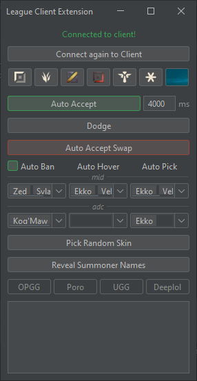

# League Client Extension

### ⚠️ Java 21 or higher needs to be installed for it to work.

you can download java 21 here:
https://www.oracle.com/ca-en/java/technologies/downloads/#jdk21-windows

## Things to know
<ul>
  <li>It isn't truly connected to the client, so it can't know when it's disconnected. If you closed the client and reopen it, it doesn't change for "Disconnected" even though it is.</li>
  <li>The green/red toggle buttons are truly connected to the client compared to the rest so their states will change accordingly. They disconnect themselves if you close the client.</li>
</ul>

#### For the Auto Accept
<ul>
  <li>You can put a delay, useful to deny queue manually if needed</li>
</ul>

#### For the Auto Champ-Select
<ul>
  <li>Champions will be banned/hovered/picked depending on the lane written(can be changed with the icons above)</li>
  <li>It will never ban a champion your team has already banned/hovered</li>
  <li>It will never pick a champion any team has banned/picked</li>
  <li>For example here it will try to ban Zed, if Zed is already banned/hovered by the team it will ban Sylas instead and if Sylas is already banned/hovered it will just do nothing</li>
</ul>

#### For the Summoners Reveal
<ul>
  <li>I only did the opgg/poro/ugg/deeplol links for NA and EUW</li>
</ul>
